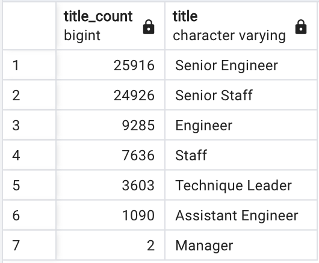
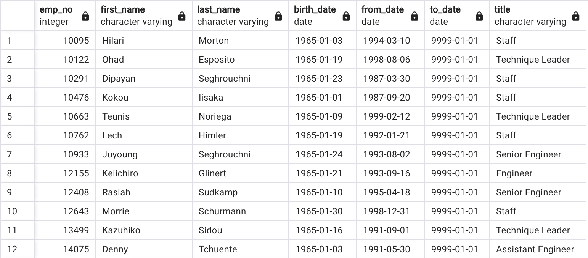
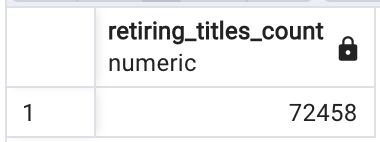
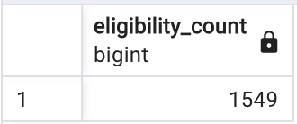
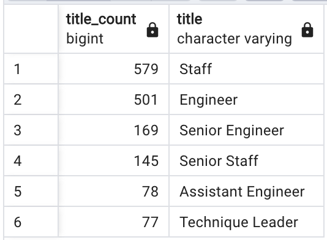

# Pewlett-Hackard Analysis
## Description
Given a database of employee and department information from the ficiticious company, Pewlett-Hackard, determine the number of retiring employees per title, and list the employees who are eligible for participation in a company mentorship program.

## Data, Queries and Tools

### Data
The following CSVs are exports of the source tables used for the analysis. They can be found in the [Data](Data) directory.
- [employees.csv](Data/employees.csv)
- [titles.csv](Data/titles.csv)
- [dept_emp.csv](Data/dept_emp.csv)

### Queries
- [Employee_Database_Challenge.sql](Employee_Database_Challenge.sql)

### Tools
- PostgreSQL 14 (2.5.12)
- pgAdmin 4 (6.16)

## Analysis

### Number of Retiring Titles
The following image shows the results of the newly created [retiring_titles](Data/retiring_titles.csv) table.



### Mentorship Eligibility
The following image shows the first 12 rows of the newly created [mentorship_eligibility](Data/mentorship_eligibility.csv) table.



### Results
- *Senior Engineer* and *Senior Staff* makes up the vast majority employees who will be retiring soon.
- Only two managers will be retiring soon.
- 72,458 employees will be retiring soon. (See below for query and results)
- 1,549 employees are eligible for the mentorship program (See below for query and results)

## Summary
Two questions are of paramount importance in this analysis: 

### *How many roles need to be filled at Pewlett_Hackard?*

By running the query

```
SELECT SUM(title_count) as retiring_titles_count
FROM retiring_titles;
```

We find




### *Are there enough qualified, retirement-ready employees to mentor?*

By running the query

```
SELECT COUNT(*) as eligibility_count
FROM mentorship_eligibility;
```

We find



So we see that, yes, there are enough retiring employees available to mentor other employees. However, we may be more interested in asking the question if there are enough retiring employees to mentor *in each title title*. We can investigate this with the following query:

```
SELECT COUNT(*) as title_count, title
FROM mentorship_eligibility
GROUP BY title
ORDER BY title_count DESC;
```

And we find



Comparing this with the retiring title counts above, we see that there are enough retiring employees in each title category to mentor those eligible for the mentorship program. Though we see that although two managers are retiring, there are none to be mentored at the present moment. We may or may not expect this depending on how Pewlett-Hackard structures its peronnel.